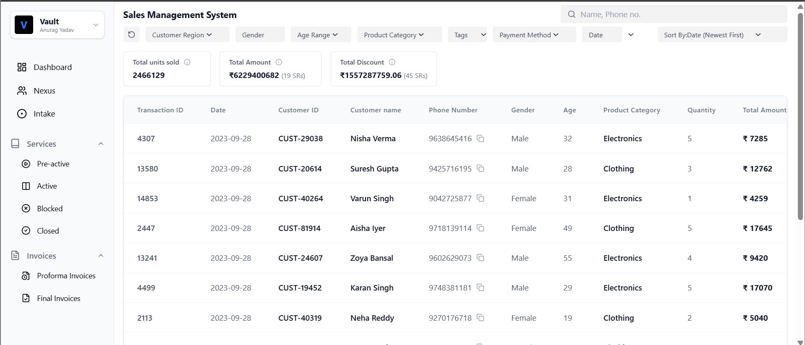
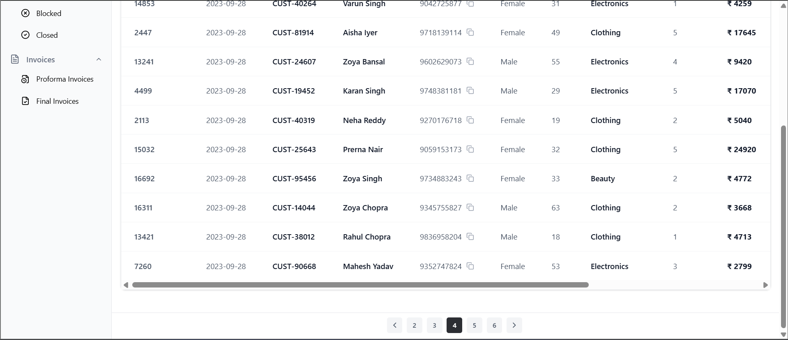

# Sales Management System (MERN Stack)

##  Deployment Links

| Service | Status | URL |
| :--- | :--- | :--- |
| **Frontend** | 🟢 Live | [Click](https://sales-management-system-steel.vercel.app) |
| **Backend** | 🟢 Live | [Click](https://sales-management-system-s9cs.onrender.com/health) |

---

## 📸 Project Screenshots

### 1. Dashboard & Data Table

*Displays the main sales table with pagination, sorting, and filtering controls.*

### 2. Pagination View


---

##  Project Summary

The **Sales Management System** is a full-stack web application designed to handle high-volume sales data efficiently. It solves the problem of "frontend lag" by offloading complex operations to the backend.

**Key capabilities include:**
* **Debounced Search:** Users can search by Name or Phone Number without overloading the server.
* **Advanced Filtering:** Multi-criteria filtering for Gender and Categories.
* **Optimized Pagination:** Uses MongoDB `skip` & `limit` to serve data in small chunks.
* **Data Aggregation:** Provides real-time statistical summaries using MongoDB Aggregation Pipelines.

## 🛠 Tech Stack

### Frontend
* **React.js (Vite)**
* **Tailwind CSS** for styling
* **Axios** for API requests

### Backend
* **Node.js & Express.js**
* **MongoDB & Mongoose**
* **CORS & Dotenv** for security and configuration

---

##  Repository Structure

This repository is divided into two main modules:

1.  **`/frontend`**: Contains the React Vite client application.
    * *See `frontend/README.md` for setup instructions.*
2.  **`/backend`**: Contains the Node.js/Express API server.
    * *See `backend/README.md` for setup instructions.*

---

##  Quick Start

To run the full stack locally:

1.  **Setup Backend:**
    ```bash
    cd backend
    npm install
    # Set up .env with MONGO_URI and FRONTEND_URL
    node index.js
    ```

2.  **Setup Frontend:**
    ```bash
    cd ../frontend
    npm install
    # Set up .env with VITE_BACKEND_URL
    npm run dev
    ```
